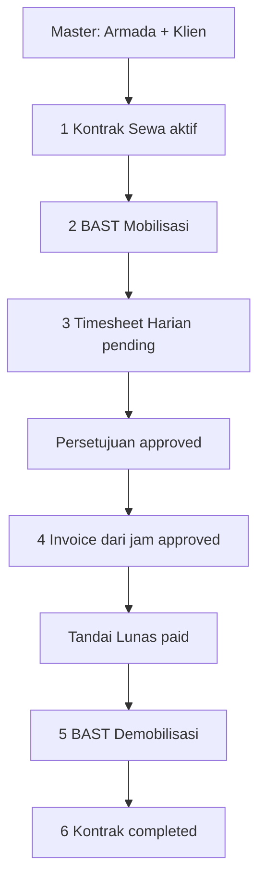

# HeavyOps — Roadmap & Analisa Teknis

> Dokumen ini berisi: (1) analisa kode dan arsitektur saat ini, (2) pemetaan alur kerja aplikasi, (3) analisa kesiapan & rencana migrasi ke Supabase, dan (4) roadmap pengembangan bertahap.
>
> Dibuat: 11 September 2026 · Basis: commit `3041977` (`rentalin-mvp`) · Branch kerja: `arena/01a08e34-rentalin`

---

## Daftar Isi

1. [Ringkasan Eksekutif](#1-ringkasan-eksekutif)
2. [Profil Repositori & Stack Teknologi](#2-profil-repositori--stack-teknologi)
3. [Struktur Kode & Arsitektur](#3-struktur-kode--arsitektur)
4. [Analisa Kode](#4-analisa-kode)
5. [Alur Kerja Aplikasi](#5-alur-kerja-aplikasi)
6. [Analisa Migrasi ke Supabase](#6-analisa-migrasi-ke-supabase)
7. [Roadmap Pengembangan](#7-roadmap-pengembangan)
8. [Risiko & Mitigasi](#8-risiko--mitigasi)
9. [Lampiran](#9-lampiran)

---

## 1. Ringkasan Eksekutif

**HeavyOps** adalah ERP internal untuk perusahaan rental alat berat (Next.js 16 App Router + PostgreSQL/Drizzle + Supabase Auth). MVP-nya sudah berfungsi penuh untuk siklus bisnis inti: **armada → kontrak → timesheet → persetujuan → invoice → dokumen PDF (SPH/BAST/Invoice) dengan QR verifikasi publik**.

| Aspek | Status | Catatan |
|---|---|---|
| Fungsionalitas inti (7 modul) | ✅ Selesai | Fleet, Clients, Contracts, Timesheets, BAST, Invoices, Settings |
| Autentikasi Supabase | ✅ Terintegrasi | `@supabase/ssr`, validasi `getUser()`, role dari tabel `profiles` |
| Skema DB + RLS | ✅ Tersedia | `schema.sql` siap Supabase (FK `auth.users`, policy RLS per role) |
| Dokumen PDF + verifikasi QR | ✅ Selesai | Invoice, SPH, BAST · A4 · kop surat · QR publik |
| Keamanan layer server | ⚠️ Perlu penajaman | Semua mutasi diotorisasi, tetapi route laporan/PDF belum membatasi role |
| Performa & skala | ⚠️ Utang teknis | Full-table scan 7 tabel, dimuat 2× per request, tanpa pagination SQL |
| Testing & CI | ❌ Belum ada | Playwright terpasang tapi 0 test; tidak ada CI pipeline |
| Fitur lanjutan (audit log, payment ledger, dsb.) | ❌ Belum ada | Sudah diakui di README sebagai iterasi berikutnya |

**Kesimpulan besar:** aplikasi ini *sudah Supabase-ready* untuk auth dan skema — yang tersisa untuk produksi adalah **hardening** (provisioning user, pooler, signup tertutup, SMTP) dan **pembayaran utang teknis** (performa, test, index) sebelum fitur baru. Roadmap di Bagian 7 disusun dalam 4 fase dengan prioritas tersebut.

---

## 2. Profil Repositori & Stack Teknologi

| Lapisan | Teknologi | Versi | Peran |
|---|---|---|---|
| Framework | Next.js (App Router, Turbopack) | 16.3.4 | SSR, Server Actions, Route Handlers |
| UI runtime | React | 19.2.6 | Server + Client Components |
| Bahasa | TypeScript (strict) | 5.9.3 | Seluruh kode |
| Database | PostgreSQL | — | Data operasional + generated columns + constraints |
| ORM | Drizzle ORM + drizzle-kit | 0.45.2 | Query, transaksi, schema definition |
| Auth | Supabase Auth (`@supabase/ssr`, `@supabase/supabase-js`) | 0.12.7 / 2.116 | Password sign-in, sesi cookie |
| UI kit | Radix UI (Dialog, Slot) + Tailwind CSS 4 + lucide-react | 1.x / 4.1.17 | Primitif komponen + styling |
| Chart | Recharts | 3.10.1 | Grafik pendapatan & distribusi armada |
| PDF | `@react-pdf/renderer` + `qrcode` | 4.9.0 / 1.5.4 | PDF server-side + QR verifikasi |
| Testing (terpasang, belum dipakai) | Playwright | 1.63.0 | — |

**Konvensi penting di repo ini:**

- Antarmuka 100% Bahasa Indonesia; format uang `Intl.NumberFormat('id-ID', IDR)`.
- Tanpa landing page — `/` langsung redirect ke `/dashboard`.
- Semua mutasi data lewat **Server Actions** (`src/app/actions.ts`); Route Handler hanya untuk health, CSV, dan PDF.
- `proxy.ts` adalah middleware generasi Next.js 16 (pengganti `middleware.ts`) — dipakai khusus refresh sesi Supabase.
- Dua sumber skema: `src/db/schema.ts` (Drizzle, untuk lokal/pratinjau via `drizzle-kit push`) dan `schema.sql` (untuk produksi Supabase, termasuk FK `auth.users` + RLS). **Keduanya harus selalu sinkron** (lihat temuan §4.4).

---

## 3. Struktur Kode & Arsitektur

### 3.1 Peta direktori

```
rentalin/
├── schema.sql                  # Skema produksi Supabase: tabel, constraint, RLS, fungsi current_app_role()
├── drizzle.config.json         # Konfigurasi drizzle-kit (DB lokal pratinjau)
├── src/
│   ├── proxy.ts                # Middleware Next 16: refresh sesi Supabase utk /dashboard, /login, /api/documents
│   ├── db/
│   │   ├── index.ts            # Pool `pg` + instance Drizzle (singleton via globalThis)
│   │   ├── schema.ts           # Definisi Drizzle: 8 tabel + unique/check constraint + generated columns
│   │   └── seed.ts             # Seed data demo (hanya mode pratinjau, advisory lock, idempotent)
│   ├── lib/
│   │   ├── auth.ts             # Klien Supabase SSR, requireUser(roles), flag isConfigured/isPreview
│   │   ├── data.ts             # getWorkspaceData(): muat seluruh data workspace + type WorkspaceData
│   │   └── format.ts           # Format uang/tanggal, kamus label status, todayISO
│   ├── app/
│   │   ├── actions.ts          # Server Actions: saveRecord, changeStatus, deleteClient, signIn, signOut
│   │   ├── login/page.tsx      # Halaman login (LoginForm client component)
│   │   ├── dashboard/
│   │   │   ├── layout.tsx      # Shell + getWorkspaceData()  ← muat data ke-1
│   │   │   ├── page.tsx        # Overview metrik/grafik     ← muat data ke-2
│   │   │   ├── [module]/page.tsx  # Router modul generik (fleet|clients|contracts|timesheets|bast|invoices|settings)
│   │   │   └── timesheets/new/page.tsx
│   │   ├── verify/doc/page.tsx # Halaman verifikasi dokumen PUBLIK (hanya nomor + jenis dokumen)
│   │   └── api/
│   │       ├── health/route.ts         # Cek koneksi DB
│   │       ├── report/route.ts         # Export CSV laporan operasional
│   │       └── documents/[kind]/[id]/route.ts  # PDF invoice|sph|bast + QR
│   └── components/             # Shell, Overview, ModuleWorkspace (UI generik 7 modul), PDF, form login
```

### 3.2 Diagram arsitektur

```
┌──────────────────────────── Browser ────────────────────────────┐
│  Client Components (Shell, Overview, ModuleWorkspace, LoginForm) │
└──────────────┬───────────────────────────────┬───────────────────┘
               │ Server Actions (POST)         │ GET
┌──────────────▼───────────────────────────────▼───────────────────┐
│                 Next.js 16 Server (Vercel / Node)                 │
│                                                                   │
│  proxy.ts ── refresh sesi Supabase (cookie)                       │
│                                                                   │
│  lib/auth.ts  requireUser(roles?)                                 │
│    ├─ mode pratinjau (tanpa Supabase & bukan Vercel) → admin demo │
│    ├─ Supabase Auth.getUser()  ◄──── validasi JWT server-side     │
│    └─ lookup role di tabel profiles (Drizzle)                     │
│                                                                   │
│  Server Actions (actions.ts)      Route Handlers                  │
│   ├─ saveRecord (7 modul)          ├─ /api/health                 │
│   ├─ changeStatus                  ├─ /api/report (CSV)           │
│   ├─ deleteClient                  └─ /api/documents/[kind]/[id]  │
│   └─ signIn / signOut                    └─ render PDF + QR       │
│               │                              │                    │
└───────────────┼──────────────────────────────┼────────────────────┘
                │ Drizzle (pg Pool, koneksi langsung)                │
┌───────────────▼──────────────────────────────▼────────────────────┐
│                    PostgreSQL / Supabase                          │
│  8 tabel · generated columns (jam efektif) · CHECK constraints    │
│  partial unique index (1 kontrak aktif/unit) · RLS utk Data API   │
└───────────────────────────────────────────────────────────────────┘
                ▲
                │ (publik, tanpa auth — hanya UUID dokumen)
        /verify/doc  → cek nomor invoice/BAST/SPH
```

**Pola otorisasi berlapis:** (a) validasi sesi `getUser()` di server; (b) cek role dari `profiles` di *setiap* Server Action dan Route Handler; (c) constraint DB (unique/check) sebagai benteng terakhir; (d) RLS di `schema.sql` mengamankan akses langsung via Supabase Data API (yang tidak dipakai aplikasi — koneksi Drizzle mem-bypass RLS sebagai kredensial trusted server).

---

Analisa kode, temuan, dan status perbaikan terkini: lihat [`audit.md`](audit.md)
(dokumen ini fokus ke alur kerja, migrasi Supabase, dan roadmap fase berikutnya).

## 5. Alur Kerja Aplikasi

### 5.1 Alur bisnis utama (happy path)



> Urutan mengikat: kontrak aktif dulu, BAST mengapit masa sewa
> (mobilisasi awal, demobilisasi akhir), invoice hanya dari jam
> approved belum tertagih, unit bebas lagi setelah kontrak completed.
> BAST 12 titik: mesin, hidraulik, rantai/roda, oli, BBM, aki, lampu,
> rem, bucket, kabin, APAR/P3K, SIKO (migrasi 0006).

### 5.3 Alur autentikasi & sesi

1. `POST` login → Server Action `signIn` → `supabase.auth.signInWithPassword` → cookie sesi diset via adapter cookie `@supabase/ssr` → redirect `/dashboard`.
2. Setiap request halaman `/dashboard`: `proxy.ts` memanggil `getUser()` untuk **refresh token** bila kedaluwarsa (cookie baru ditulis ke response).
3. Setiap Server Component / Action memvalid ulang via `requireUser()` → `getUser()` (tidak percaya cookie mentah) → ambil `profiles.role` → cek role yang diizinkan.
4. `signOut` menghapus sesi Supabase → redirect `/login`.
5. Mode pratinjau (tanpa env Supabase & tanpa Vercel): `requireUser` mengembalikan admin demo `Aditya Pratama` dan `seedPreview()` mengisi data contoh — dipanggil dari `getWorkspaceData` sehingga self-seeding saat kunjungan pertama.

### 5.4 Alur dokumen PDF & verifikasi

1. User klik ikon unduh → `GET /api/documents/{invoice|sph|bast}/{uuid}`.
2. Route memuat `getWorkspaceData()` (seluruh workspace), menyusun `PdfData` sesuai jenis dokumen (invoice: subtotal/PPN/total + status; BAST: kondisi mesin/hidraulik/track; SPH: periode + tarif).
3. QR berisi `${APP_URL}/verify/doc?id=<uuid>` digenerate → `renderToBuffer(BusinessDocument)` → PDF A4 dengan kop surat, tabel, ruang tanda tangan manual, footer QR.
4. Pihak eksternal memindai QR → halaman publik `/verify/doc` → query langsung ke 3 tabel → tampilkan hanya **nomor & jenis** dokumen (tanpa nilai finansial).

---

## 6. Analisa Migrasi ke Supabase

### 6.1 Status kesiapan — apa yang SUDAH ada

Aplikasi ini **bukan** migrasi dari nol; integrasi Supabase sudah dirancang sejak awal:

| Komponen | Status | Lokasi |
|---|---|---|
| Autentikasi password (server-side) | ✅ | `actions.ts#signIn`, `lib/auth.ts` |
| Validasi sesi `getUser()` di setiap permintaan server | ✅ | `lib/auth.ts#requireUser` |
| Refresh sesi otomatis (middleware) | ✅ | `proxy.ts` |
| Role dari tabel `profiles` (bukan user metadata) | ✅ | `lib/auth.ts`, `schema.sql` |
| Skema produksi dengan FK `auth.users` | ✅ | `schema.sql` |
| RLS policy per role utk Supabase Data API | ✅ | `schema.sql` (`current_app_role()`) |
| Strategi koneksi: Drizzle langsung via `DATABASE_URL` (trusted, bypass RLS) + otorisasi di layer server | ✅ | `db/index.ts` |
| Flag fail-closed produksi | ✅ | `isConfigured()`, `isPreview()` |

### 6.2 Gap yang harus ditutup untuk produksi

| # | Gap | Keterangan |
|---|---|---|
| G1 | **Provisioning user** | Tidak ada mekanisme membuat `auth.users` + `profiles` berpasangan. Butuh: prosedur admin (SQL/Edge Function) atau trigger `AFTER INSERT ON auth.users` yang membuat `profiles` ber-role default, plus UI manajemen user (Fase 2). Public signup **harus dimatikan**. |
| G2 | **Connection pooling** | Vercel serverless + Supabase: wajib lewat **Supavisor**. Untuk Drizzle `node-postgres`, gunakan **session pooler** (port 5432) atau transaction pooler (port 6543) dengan prepared statement dimatikan dan `max` pool kecil (≤5). Tanpa ini, koneksi TCP habis. |
| G3 | **Variabel lingkungan** | `DATABASE_URL` (pooler + `sslmode=require`), `NEXT_PUBLIC_SUPABASE_URL`, `NEXT_PUBLIC_SUPABASE_PUBLISHABLE_KEY`/`ANON_KEY`, `NEXT_PUBLIC_APP_URL` (origin kanonik untuk QR). Belum ada `.env.example` di repo. |
| G4 | **Konfigurasi project Supabase** | Nonaktifkan public signup, set Site URL & Redirect URLs ke domain produksi, custom SMTP + template email (invite/reset), kebijakan password. |
| G5 | **Strategi migrasi skema** | Sekarang: dua artefak manual (`schema.sql` vs `drizzle-kit push`). Butuh disiplin migrasi (lihat §4.4) agar pratinjau lokal ≠ produksi tidak menimbulkan bug silang. |
| G6 | **Backup & observability** | Aktifkan PITR/backup harian Supabase, pantau log Drizzle/pg, health check diperluas (sekarang hanya `select 1`). |
| G7 | **Data historis (bila ada sistem lama)** | Belum ada skrip ETL/impor CSV untuk armada, klien, kontrak berjalan — diperlukan bila go-live dengan data nyata. |

### 6.3 Opsi arsitektur akses data (keputusan penting)

**Opsi A — Pertahankan pola sekarang (rekomendasi untuk fase ini):** Drizzle tetap konek langsung ke Postgres Supabase via Supavisor. Otorisasi tetap di Server Actions. RLS tetap aktif sebagai proteksi Data API (yang tidak dipakai publik). ✅ Perubahan minimal, transaksi & `FOR UPDATE` tetap berfungsi penuh.

**Opsi B — Pindahkan query ke Supabase Data API + RLS:** menghapus kredensial DB dari server, tapi: (1) `FOR UPDATE`/advisory lock tidak tersedia via PostgREST, (2) transaksi multi-statement butuh RPC/Edge Function, (3) logika invoice harus ditulis ulang sebagai fungsi SQL. ❌ Terlalu mahal untuk sekarang; bisa dipertimbangkan parsial nanti (mis. read-only client-side search).

**Opsi C — Hibrida:** tetap Opsi A, tambah Edge Function untuk cron `overdue` & webhook provisioning user. ✅ Direkomendasikan sebagai pelengkap.

### 6.4 Checklist go-live Supabase (langkah demi langkah)

```text
□ 1. Buat project Supabase (region terdekat: Singapore).
□ 2. Jalankan schema.sql di SQL Editor (database kosong!). Verifikasi:
     - 8 tabel + constraint + generated columns
     - RLS enabled + policy terpasang (SELECT pg_policies)
□ 3. Authentication → Providers: matikan "Enable Signup" (internal-only).
□ 4. Authentication → URL Configuration: Site URL = domain produksi;
     tambah redirect /login dan /dashboard.
□ 5. (Opsional) Custom SMTP + template undangan/reset password.
□ 6. Buat user: auth.admin.createuser (dashboard) → lalu INSERT profiles:
       INSERT INTO profiles (id, full_name, role)
       VALUES ('<uuid-user>', '<nama>', 'admin');   -- ulangi per pengguna
□ 7. Ambil kredensial:
     - Project Settings → Database → Connection string → Session pooler (5432)
     - Project Settings → API → URL + publishable/anon key
□ 8. Set env di Vercel:
     DATABASE_URL=postgresql://postgres.<ref>:<pwd>@aws-0-<region>.pooler.supabase.com:5432/postgres?sslmode=require
     NEXT_PUBLIC_SUPABASE_URL=...
     NEXT_PUBLIC_SUPABASE_PUBLISHABLE_KEY=...
     NEXT_PUBLIC_APP_URL=https://<domain>
□ 9. Deploy Vercel → cek /api/health (ok:true).
□ 10. Login akun admin → lengkapi Pengaturan (kop surat) → uji:
      buat unit → klien → kontrak → timesheet → approval → invoice → PDF → QR verify.
□ 11. Aktifkan backup (PITR) + simpan schema.sql versi terkunci di repo.
□ 12. Dokumentasikan runbook provisioning user untuk admin non-teknis.
```

> ⚠️ Jangan jalankan `schema.sql` dan `drizzle-kit push` ke database produksi yang sama (peringatan README). Lokal pratinjau = `drizzle-kit push`; produksi = `schema.sql`/migrasi terkontrol.

---

## 7. Roadmap Pengembangan

Estimasi = effort relatif untuk 1–2 engineer. Prioritas mengikuti prinsip: **keamanan → kebenaran finansial → performa → fitur**.

### Fase 0 — Stabilisasi & Kualitas Dasar *(±1–2 minggu)* — 🔴 mulai di sini

| # | Item | Detail | Prioritas |
|---|---|---|---|
| 0.1 | Batasi role pada `/api/report` & `/api/documents` | Hanya `admin, finance, operations` (temuan S1) — ✅ **selesai** (Quick Win #1, termasuk RLS `invoices` di migration 0004) | ✅ |
| 0.2 | Hilangkan fetch ganda | `cache()` pada `getWorkspaceData` (atau pindah fetch ke layout dan teruskan via props/context) | 🔴 |
| 0.3 | `.env.example` + dokumentasi variabel | Semua env dari §6.4 | 🔴 |
| 0.4 | CI pipeline | GitHub Actions: lint + typecheck + uji finansial + build tanpa env + audit prod tiap push/PR (`.github/workflows/ci.yml`) — selesai | ✅ |
| 0.5 | Test inti finansial | Uji rumus produksi berjalan di CI: `scripts/finance-check.ts` (rumus invoice, status ledger, anti-overpayment) + `scripts/task1b-check.ts` — selesai; e2e Playwright menyusul bila dibutuhkan | ✅ |
| 0.6 | Indeks FK & status | `contracts.client_id`, `invoices.contract_id`, `handovers.contract_id`, `timesheets.operator_id/invoice_id`, `fleet.status` di **kedua** skema | 🟡 |
| 0.7 | Satukan sumber skema | `drizzle-kit generate` → folder `drizzle/` migrasi; `schema.sql` jadi bootstrap Supabase; seragakan nullable `operator_id` | 🟡 |
| 0.8 | Perbaikan kecil | `lang="id"`, verify page pakai `company_settings`, formula PPN seed kini add-on (konsisten `finance.ts`), `drizzle.config.ts` baca env — selesai | ✅ |

**Kriteria selesai:** CI hijau, test inti lulus, tidak ada fetch ganda, semua rute finansial ber-role, indeks terpasang.

### Fase 1 — Produksi Supabase *(±2–3 minggu, paralel dengan uji coba lapangan)*

| # | Item | Detail |
|---|---|---|
| 1.1 | Hardening project Supabase | Checklist §6.4 lengkap (signup off, redirect, SMTP, backup/PITR) |
| 1.2 | Provisioning user | Skrip SQL/Edge Function pembuat `profiles` otomatis dari `auth.users` (role default `operator`, admin ubah via SQL/panel) + runbook |
| 1.3 | Konfigurasi pooler | Session pooler via Supavisor, ukuran pool ketat, uji beban halaman berat |
| 1.4 | Reset password & undangan | Flow "lupa sandi" di `/login` + halaman reset; undangan user via email admin |
| 1.5 | Observability | `/api/health` diperluas (cek Supabase Auth reachable), log error terstruktur (mis. Sentry), alert Vercel |
| 1.6 | Data historis | Skrip impor CSV armada/klien/kontrak berjalan + validasi pra-go-live (bila perlu) |
| 1.7 | Pilot terbatas | 1–2 kontrak nyata berjalan paralel dengan proses manual selama 2 minggu |

**Kriteria selesai:** produksi live dengan auth nyata, runbook teruji, pilot tanpa insiden kritis.

### Fase 2 — Penguatan Operasional *(±4–6 minggu)*

| # | Item | Detail |
|---|---|---|
| 2.1 | **Audit log** | Tabel `audit_log(actor, action, entity, entity_id, before/after jsonb, at)` diisi dari Server Actions; tampilan riwayat per record untuk admin |
| 2.2 | **Payment ledger** | Tabel `payments(invoice_id, amount, method, reference, paid_at)`; status invoice dihitung dari akumulasi (unpaid/partial/paid) — menggantikan toggle manual |
| 2.3 | **Overdue otomatis** | pg_cron/Edge Function harian: invoice `due_date < today` & belum lunas → `overdue` + notifikasi |
| 2.4 | **Penugasan operator** | Tabel `contract_operators(contract_id, operator_id)`; operator hanya melihat/mengisi kontraknya; admin bisa submit atas nama operator |
| 2.5 | **Pagination & filter server-side** | Query per-modul dengan `WHERE/LIMIT/OFFSET`, search SQL (`ILIKE`/trigram index), agregasi dashboard di SQL |
| 2.6 | **UI manajemen user** | Admin mengelola user & role dari `/dashboard/users` (via service role/admin API + audit) |
| 2.7 | **Lampiran foto BAST** | Supabase Storage bucket privat, upload dari form BAST, tampil di PDF & halaman detail; RLS storage per role |
| 2.8 | **Notifikasi** | In-app (sudah ada badge) + email opsional: timesheet menunggu approval, invoice jatuh tempo, SIKO/asuransi 30 hari |
| 2.9 | **PPN configurable** | `company_settings.ppn_rate` + validasi; dokumen & invoice memakai nilai setting |
| 2.10 | Penomoran dokumen berurutan | `PREFIX/TAHUN/001` via `pg_advisory_xact_lock` per prefix+tahun (`src/lib/docnum.ts`) — lebih kuat dari retry 23505; KTR/BAST/INV otomatis berurutan, format lama diabaikan — selesai |
| 2.11 | **Reset database (admin)** | Menu Zona Berbahaya di Pengaturan: hapus data operasional (timesheet, BAST, invoice, kontrak, klien, armada) via Server Action resetDatabase, proteksi frasa HAPUS SEMUA DATA, profil + pengaturan dipertahankan — selesai |
| 2.12 | **BAST 12 titik pemeriksaan** | Daftar Pemeriksaan Unit: mesin, hidraulik, rantai/roda, oli, bbm, aki, lampu, rem, bucket, kabin, APAR/P3K, SIKO; migrasi 0006_bast_checklist.sql, tampil di form + PDF — selesai |
| 2.13 | **Menu sidebar grup bernomor** | Opsi B: DATA POKOK (armada, klien), SEWA BERJALAN (1. kontrak, 2. BAST, 3. timesheet), KEUANGAN (4. invoice); search + bantuan ikut nama baru — selesai |
| 2.14 | **Bulk armada + kategori custom** | Tambah Banyak: prefix + nomor awal + jumlah 1–50 (satu baris = satu fisik, duplikat dilewati); kategori custom via opsi + Tambah kategori baru; komposisi armada di info-callout; tanpa migrasi — selesai |
| 2.15 | **PDF kompak BAST/SPH + QR fallback** | BAST Tabel A info + Tabel B checklist No/Komponen/Kondisi; TTD kompak wrap=false; URL verifikasi teks di footer bila QR gagal; boleh 2 halaman — selesai |
| 2.16 | **Revisi kontrak (amandemen)** | Hanya kontrak aktif; ubah periode/tarif/ganti unit tersedia + alasan ≥10 karakter; tiap revisi bernomor di `contract_revisions` (migrasi 0007 + RLS); tolak periode memotong timesheet & ganti unit bila timesheet ada; tarif baru hanya untuk jam belum tertagih — selesai |
| 2.17 | **Skala tipografi & aksi tabel** | Naikkan skala font UI (body 13→16px; teks kecil 7–13px → +2–3px, ±219 deklarasi di `globals.css`) tanpa menyentuh PDF; seluruh tombol aksi tabel jadi ikon + label (Ubah/Hapus/Revisi/Selesai/Tandai Lunas/Setujui/Tolak/Unduh) dengan pemisah antar tombol; tick chart ikut naik — selesai |
| 2.18 | **PDF: QR vektor, BAST 1 halaman, nama penandatangan** | QR footer digambar sebagai path SVG dari matriks `qrcode` (tanpa decoder PNG/Image); kompaksi padding/margin BAST agar 12 titik + blok TTD muat 1 halaman A4; nama penandatangan vendor dari `company_settings.signer_name/signer_title` + nama klien dari `clients.pic_name`, tampil untuk SPH/BAST/Invoice; migrasi 0008 — selesai |
| 2.19 | **Template PDF dinamis (Pengaturan > Template PDF)** | Tabel `document_templates` (kind/version/status/content JSON/variables) + RLS mirror settings + seed 4 template published v1 (migrasi 0020); editor admin 2-tab (Perusahaan + Template PDF), 4 sub-tab jenis surat, sisip `{{variabel}}`, draft + publish + histori + rollback, preview PDF; route PDF pakai template published dengan fallback hardcoded; QR perjanjian bawa `&kind=`; PDF non-invoice dikunci login internal; BAST boleh 2+ halaman bila teks kustom panjang — selesai |
| 2.20 | **BAST: Ubah + unique constraint + optimasi query** | Tombol Ubah di row BAST untuk revisi (tanggal/checklist/foto/catatan); form support edit mode dengan defaultValue; PhotoUploader support existing photos; backend UPDATE handler; migrasi 0021 bersihkan duplikat mobilisasi (simpan 1 tertua per kontrak) + unique constraint `(contract_id, type)` level DB; desain final 1 mobilisasi + 1 demobilisasi per kontrak (maks 2 baris); optimasi getFormOptions LIMIT 100 untuk performa — selesai |
| 2.21 | **BAST: memo checklist + foto, hierarki form** | `BastChecklist` + `PhotoUploader` diekstrak dari `RecordModal` menjadi komponen `memo` dengan callback stabil (`useCallback`); checkbox tetap uncontrolled (`defaultChecked`) sehingga klik terasa instan tanpa rekonsiliasi pohon modal; label full-row 18px + hover + umpan balik checked; header seksi "Informasi BAST" & "Dokumentasi Kondisi Unit"; thumbnail 72px — selesai |
| 2.22 | **Dasbor kompak + tren pendapatan harian** | KPI dipadatkan (±95–105px: padding 13px, value 26px, ikon 30px); spacing antar-seksi 16–18px; heading ringkas; chart 280px; rentang 7 Hari / 1 Bulan / 3 Bulan / 6 Bulan / 1 Tahun / Semua — 7H/1B memakai agregat harian nyata 62 hari (`revenueByDay` di `getDashboardData`, read-only tanpa migrasi), sisanya agregat bulanan; samakan `metric-value` 760px ke 26px — selesai |
| 2.23 | **Media layer R2 — foto fleet (cover + galeri)** | Arsitektur `docs/media-architecture.md`: tabel `media_files` (migrasi 0023 + RLS, constraint pair entity/category) + Cloudflare Worker Media API (`media-worker/`: `upload-url`/`complete`/`GET :id`/`DELETE :id`, auth JWT GoTrue + role `profiles` via Data API, validasi MIME/ukuran/object-key + **magic bytes** saat completion) + R2 privat 3 env (`rentalin-{dev,staging,production}-media`, presigned PUT langsung dari browser — binary tidak lewat Vercel) + kompresi sisi klien WebP ≤1600px q80 (fallback JPEG, hard cap 2 MB, progress XHR) + Server Action `requestFleetPhotoUpload`/`completeFleetPhotoUpload`/`deleteFleetPhoto`/`getFleetMedia` (peran: upload admin/operations/operator, hapus admin/operations) + UI "Foto Unit" (memoized, fail-soft) + thumbnail list fleet (signed URL pendek, lazy, independent dari KPI) + audit upload/delete + `MEDIA_API_URL` opsional (tanpa ini fitur nonaktif, aplikasi normal) + CSP `connect-src` host R2. Foto BAST disengaja TIDAK disentuh (Supabase Storage 0012, anti-regresi §45) — keputusan & koreksi audit dokumentasi: `docs/media-architecture.md` §52. Sisa (PR menyusul): deploy bucket/Worker + secrets, reconciler orphan `pending`/`failed`, fase BAST (migrasi PhotoUploader → Media API + cleanup legacy) — selesai (kode) |

### Fase 3 — Skala & Nilai Tambah *(±kuarter berikutnya, prioritas ditentukan feedback pilot)*

- **Mobile/PWA untuk operator**: input timesheet dari lapangan, draft offline + sinkronisasi (Supabase Realtime/queue).
- **Analitik lanjutan**: utilisasi armada per unit, profitabilitas per kontrak/klien, proyeksi pendapatan, biaya perawatan vs jam operasi.
- **Manajemen perawatan**: jadwal servis berkala berbasis HM, riwayat kerusakan mengikat ke `breakdown_hours`.
- **Integrasi akuntansi**: export jurnal ke sistem akunting (jurnal PPN, piutang), rekonsiliasi pembayaran.
- **E-signature**: tanda tangan digital BAST/kontrak (penyimpanan gambar ttd + hash dokumen) — melampaui QR verification saat ini.
- **Multi-entitas/perusahaan**: isolasi data per legal entity (`company_id` di semua tabel + RLS).
- **Rate card & musiman**: tarif per kategori unit dengan periode efektif, diskon, tarif mobilisasi.

---

## 8. Risiko & Mitigasi

| Risiko | Dampak | Likelihood | Mitigasi |
|---|---|---|---|
| Kehabisan koneksi DB di Vercel (tanpa pooler) | Down total | Tinggi bila diabaikan | Fase 1.3 (Supavisor session pooler + pool kecil) |
| Drift `schema.sql` vs `schema.ts` menimbulkan bug hanya-di-produksi | Bug silen | Sedang | Fase 0.7 (migrasi tergenerate, satu sumber kebenaran) |
| Operator/role salah melihat data finansial (S1) | Kebocoran internal | Sedang | Fase 0.1 (quick win, ≤1 hari) |
| Bug perhitungan invoice tanpa test jaring pengaman | Kerugian finansial | Sedang | Fase 0.5 (test idempotensi penagihan wajib sebelum go-live) |
| Tanpa audit log, sengketa pembayaran/kontrak sulit dibuktikan | Operasional/hukum | Sedang | Fase 2.1 |
| Akses DB langsung salah konfigurasi (env bocor di client) | Kompromi total | Rendah (pola sudah benar) | Audit env NEXT_PUBLIC_*, CI check |
| Supabase Auth signup terbuka saat produksi | Akun liar | Rendah (satu klik) | Checklist go-live item 3 |
| PPN berubah regulasi | Dokumen pajak salah | Rendah–Sedang | Fase 2.9 (konfigurasi) + verifikasi berkala |

---

## 9. Lampiran

### 9.1 Perintah harian

```sh
npx drizzle-kit push          # sinkron skema ke DB lokal pratinjau
npm run dev -- --turbopack    # jalankan lokal (mode pratinjau aktif tanpa env Supabase)
npm run lint && npm run typecheck
npx next typegen && npm exec tsc -- --noEmit
npm run build                 # validasi produksi
```

### 9.2 Variabel lingkungan

| Variabel | Wajib? | Fungsi |
|---|---|---|
| `DATABASE_URL` | ✅ | Koneksi Postgres (Supabase: connection string **session pooler** + `sslmode=require`) |
| `NEXT_PUBLIC_SUPABASE_URL` | Produksi | URL project Supabase (auth) |
| `NEXT_PUBLIC_SUPABASE_PUBLISHABLE_KEY` / `NEXT_PUBLIC_SUPABASE_ANON_KEY` | Produksi | Kunci publik auth (bukan service role!) |
| `NEXT_PUBLIC_APP_URL` | Produksi | Origin kanonik untuk tautan QR verifikasi PDF |
| `VERCEL` | Otomatis | Menonaktifkan mode pratinjau demo |

> **Jangan pernah** menyetel `SUPABASE_SERVICE_ROLE_KEY` ke aplikasi ini — semua akses sudah lewat `DATABASE_URL` trusted di server; menambah service role di sisi client adalah pintu belakang.

### 9.3 Glosarium istilah domain

| Istilah | Arti |
|---|---|
| **HM** (Hour Meter) | Pembacaan jam kerja mesin unit; dasar perhitungan sewa |
| **SIKO** | Izin kerja alat berat (Surat Izin Kerja/Operasi) dengan masa berlaku |
| **BAST** | Berita Acara Serah Terima unit (mobilisasi/demobilisasi) |
| **SPH** | Surat Penawaran Harga — PDF yang digenerate dari kontrak |
| **PPN** | Pajak Pertambahan Nilai; diaplikasi ini tetap 11% |
| **Breakdown hours** | Jam mesin berhenti karena kerusakan — dikurangi dari jam efektif |

---

*Dokumen ini hidup: perbarui status checklist dan fase seiring progres. Rekomendasi urutan kerja berikutnya: langsung eksekusi Fase 0 (semua item ≤ prioritas tinggi bisa tuntas < 1 minggu), lalu jalankan checklist go-live §6.4 sambil mengerjakan Fase 1.*
